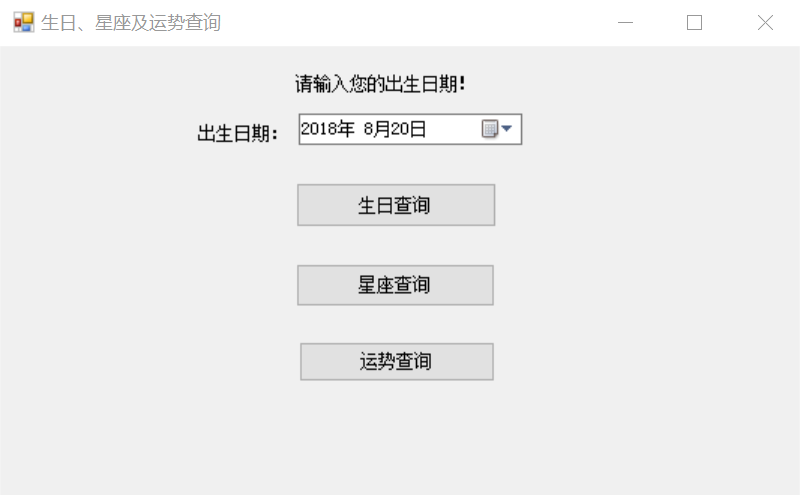
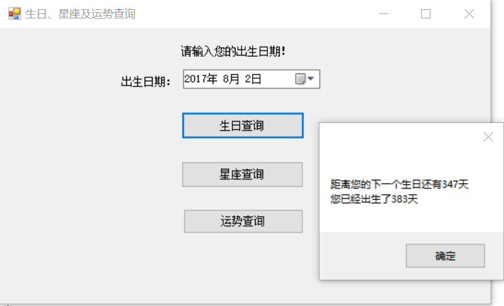
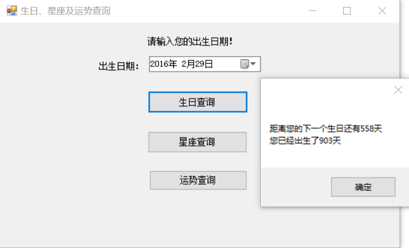
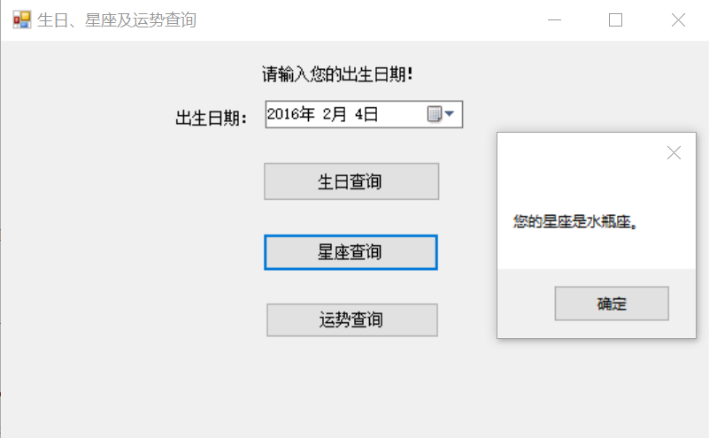
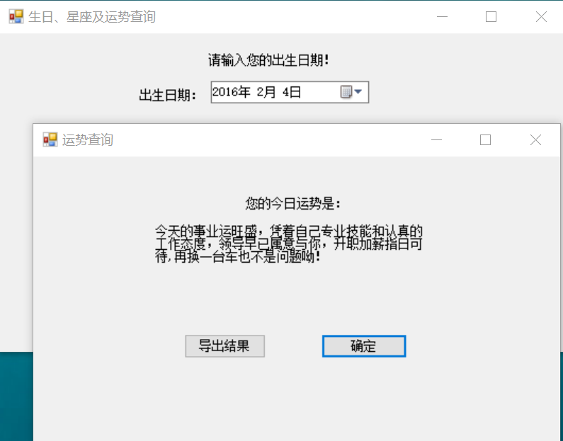
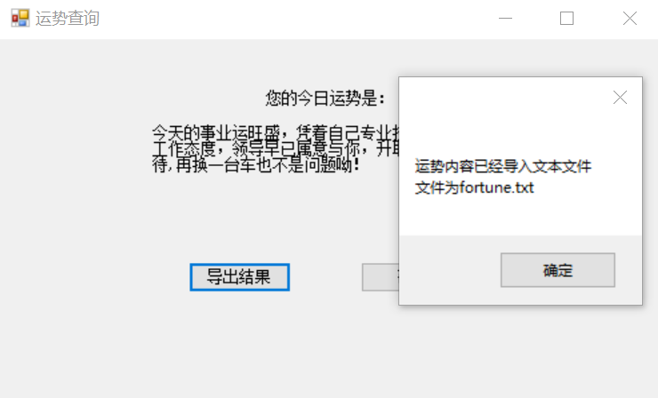
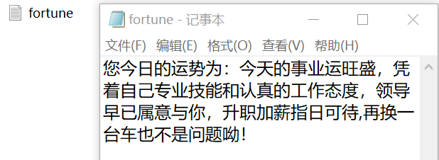

# 生日、星座及运势查询
我们小组所选择的题目是生日、星座及运势查询，可实现的功能有：
1. 用户可以输入自己的出生日期；
2. 用户可以查询当天距离自己的下一个生日还有多少天，以及自己已经出生了多少天；
3. 用户可以查询自己的星座；
4. 用户可以查询自己当天的运势并将运势内容导入到文件。
# 功能的实现
我们选择了c#的窗体来编程，使得编程更方便、程序拥有更好的灵活性、外观更加美观。
## 1.用户输入出生日期
考虑到如果用户自己输入可能会输入与日期格式不符的内容，以及可能会输入在当天之后的日期，我们先在窗体中放入一个DateTimePicker,将其允许输入的最大日期设置为当天，避免了与我们预期情况不符的情况发生，使得程序更加简洁。

## 2.查询下一个生日以及出生的天数
我们在窗体Form1中编写函数，使得能够计算某一天到当天之间有多少天以及当天到下一个日期之间有多少天，并且考虑了闰年的特殊情况，经过函数重构后还大大降低的程序的复杂性。

在窗体中放置一个生日查询的按钮，设置为一旦程序运行之后按了这个按钮，就会读取DateTimePicker中的日期代入函数，计算得到相应的结果，并跳出一个对话框将结果显示给用户。

## 3.查询星座
我们在窗体Form1中编写函数，使得能够计算某一天所对应的星座，经过函数重构后还大大降低的程序的复杂性。

在窗体Form1中放置一个星座查询的按钮，设置为一旦程序运行之后按了这个按钮，就会读取DateTimePicker中的日期代入函数，计算得到相应的结果，并跳出一个对话框将结果显示给用户。

## 4.查询运势并将结果导出至文件
我们在窗体Form1中编写函数，使能够计算某一天的“数字”，利用当天的“数字”与用户生日那一天的“数字”相减，可以得到用户在当天的幸运数字并返回。在目录下建一个类，在其中设一个幸运数字，使得这个幸运数字能够在不同窗体中共用。新建一个Form2，在其中编写函数调用幸运数字，不同的幸运数字对应不同的运势内容。

在窗体Form1中放置一个运势查询的按钮，设置为一旦程序运行之后按了这个按钮，就会读取DateTimePicker中的日期代入函数，计算得到相应的幸运数字，再得到相应的运势内容，并跳出Form2显示这个运势内容。

在Form2中放了两个按钮，一个“确认”按了之后就会关闭Form2，另一个“导出结果”按钮按了就会将运势内容导出到C盘下的fortune.txt里，如果已经有这个文件就覆盖，如果没有这个文件就新建一个再导入，成功导入以后会再跳出一个对话框提示用户。

    以上截图中程序运行时间均为2018年8月20日。

# 单元测试
我们对程序中的函数进行单元测试，除了一个判断年份是不是闰年的函数容易进行测试之外，我们将函数分为两类：
1. 代入年月日计算得到对应数字结果的函数；
2. 代入年月日返回对应字符串的函数。
## 1.代入年月日计算得到对应数字结果的函数
这样的函数有：
1. theDayBefore（计算一年当中在某一天之前的天数，不考虑闰年情况）；
2. theDayAfter（计算一年当中在某一天之后的天数，不考虑闰年情况）；
3. Span（计算某一天到当天经历了多少天，用来计算用户出生了多少天）；
4. theNextBirthday（计算用户到下一个生日还需要多少天）；
5. DayNumber（计算某一天对应的数字，用来计算LuckyNumber）;
6. LuckyNumber（计算用户在当天的幸运数字）。

经过测试函数都编写正确，但由于Span、theNextBirthday、LuckyNumber都是需要调用电脑的当天日期加入计算的，我们进行测试额日期是2018年8月19日，当在其他的时间运行测试时，测试不一定正确，若要运行需要按运行当天的日期更改测试函数来测试。
## 2.代入年月日返回对应字符串的函数
这样的函数有：
1. Constellation（代入对应日期返回用户的星座）；
2. FortuneToday（代入对应日期返回运势）；

经过测试函数都编写正确.
# 谢谢阅读！